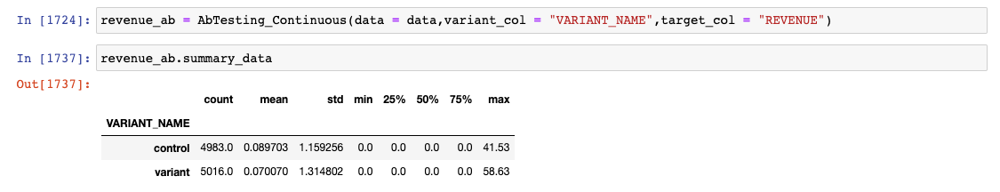
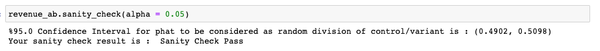
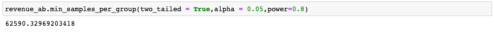

# Analysis of an AB Test

This project aims to provide a guide to understanding, optimizing and evaluating A/B tests. 

_In order to obtain meaningful results from an A/B test, we utilize a concept called the **Central Limit Theorem**. This theorem tells us that when we collect a large enough sample size, the distribution of our data tends to follow a predictable pattern, even if the underlying data itself is not normally distributed._

There will be two parts including continuous (revenue) and binary (retention) targets. We will be using revenue data from : https://www.kaggle.com/datasets/sergylog/ab-test-data
and retention data from : https://www.kaggle.com/datasets/arpitdw/cokie-cats. 

# Continuous Data

Sample preview of the revenue data:

Create an instance of an AbTesting_Continous class. Variant col is used to describe the column showing AB groups and target col is used for targeted data. Summary_data is an attribute of the instance showing to describe the data. 

Sanity check is a method created in an inherited AbTesting class. By using it you can check whether your division into control and variant groups is random or not. If it is not random, then you should check your experiment and fix it.

Minimum required sample is a method created in an inherited AbTesting class. By choosing two_tailed, power and alpha parameters you get the minimum required samples per group.

statistical_calculations is a method created in AbTesting_Continuous class. It returns a tuple and the first element is showing the unpooled sampling error and the second one is the population standard deviation which is calculated by the sample standard deviations and the last one is cohen's d number to see the effect size.

Simulation is a method created in an inherited AbTesting class.

Feel free to explore the repository, contribute to ongoing projects, and share your feedback. 
